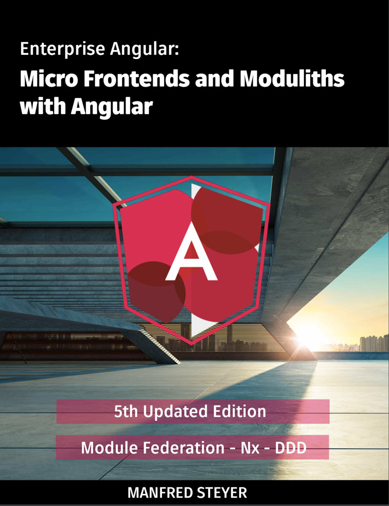

# Retrieval Augmented Generation

[RAG in Azure AI Studio](https://learn.microsoft.com/en-us/azure/ai-studio/concepts/retrieval-augmented-generation?source=recommendations)

[RAG in Azure AI Search](https://learn.microsoft.com/en-us/azure/search/retrieval-augmented-generation-overview)

## Demo

- Point out that you have uploaded the following book to Azure AI Studio in advance:

    

- Prompt the chat to ask questions about the book:

    ```prompt
    Create an overview about Angular Enterprise Patterns and Best Practices.
    ```

- Export the chat as prompt flow. You will use this later on    

## Labs

[Implement Retrieval Augmented Generation (RAG) with Azure OpenAI Service](https://learn.microsoft.com/en-us/training/modules/use-own-data-azure-openai/)