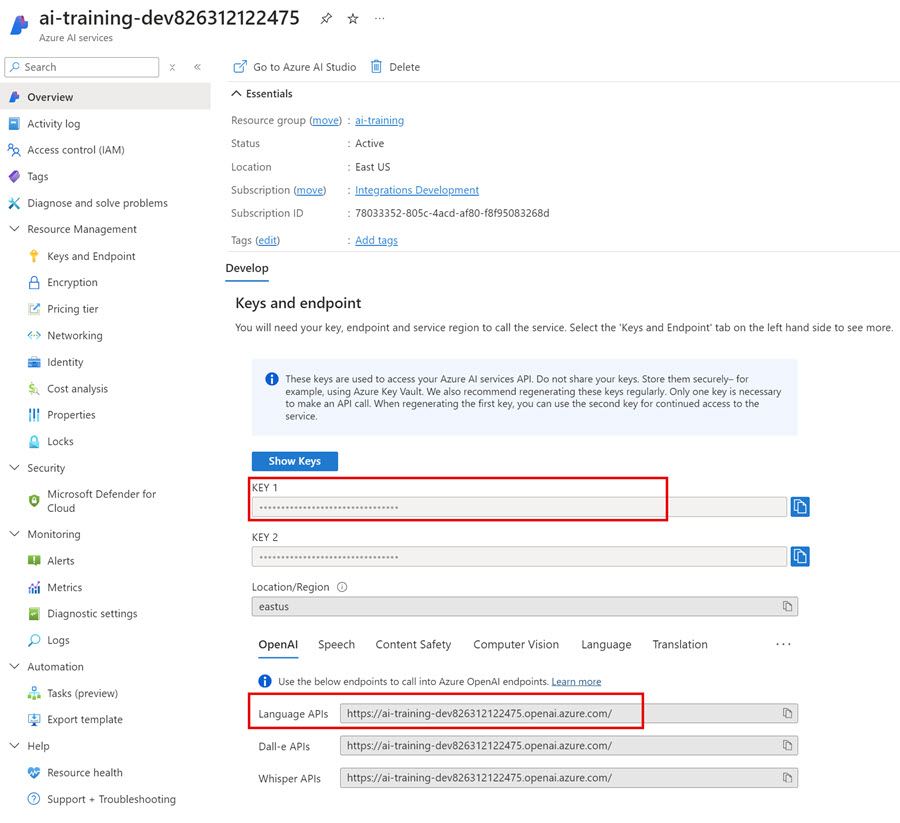

# Semantic Kernel

[Semantic Kernel](https://learn.microsoft.com/en-us/semantic-kernel/overview/?tabs=Csharp)

[Semantic Kernel GitHub](https://github.com/microsoft/semantic-kernel)

[Semantic Kernel Tools for Visual Studio Code](https://marketplace.visualstudio.com/items?itemName=ms-semantic-kernel.semantic-kernel)

## Demos

- Semantic Kernel Connect and Hello World

### Semantic Kernel Connect and Hello World

- Deploy a model ie `gtp-35-turbo` and assign a deplyoment name ie `gpt-35-turbo-deployment`

- Review your configuration

    

- Update configuration in `appsettings.json`

    ```json
    {
        "SemanticKernel": {
            "DeploymentModelName": "gpt-35-turbo-deployment",
            "Endpoint": "https://ai-training-dev826312122475.openai.azure.com/",
            "ResourceKey": "e2297856353b4e9995708a3f2a0100c6",
            "DeploymentModel": "gpt-35-turbo"
        }
    }
    ```

## Labs

[Develop AI agents using Azure OpenAI and the Semantic Kernel SDK](https://learn.microsoft.com/en-us/training/paths/develop-ai-agents-azure-open-ai-semantic-kernel-sdk/)
